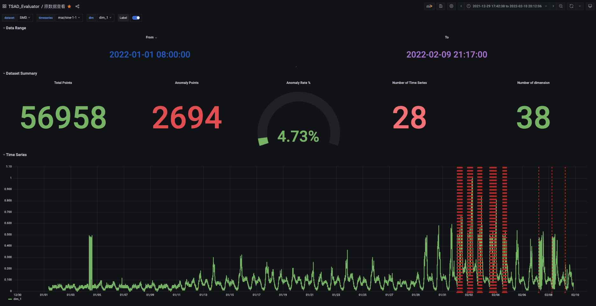
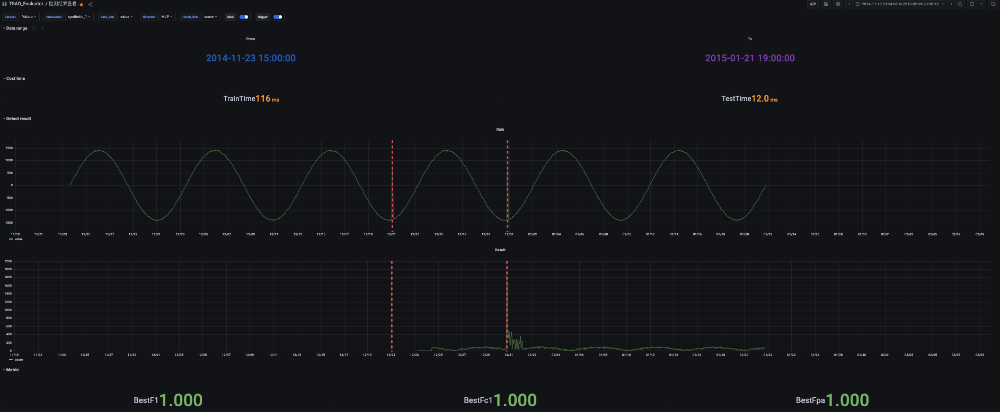
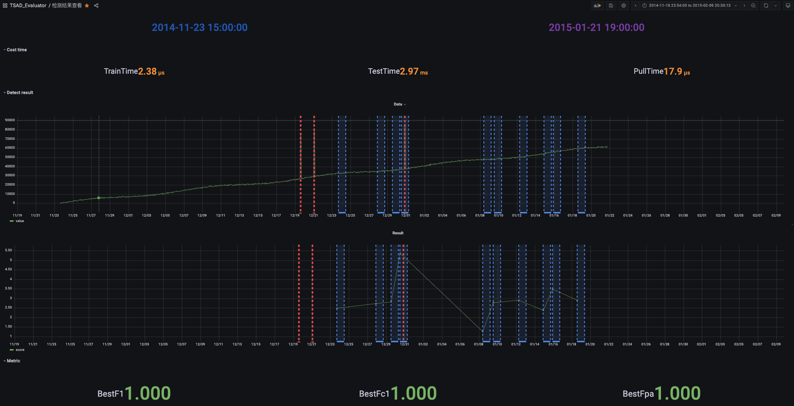
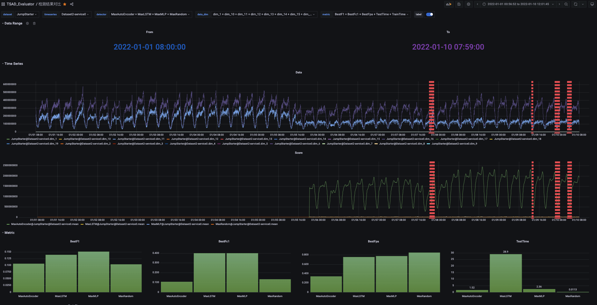
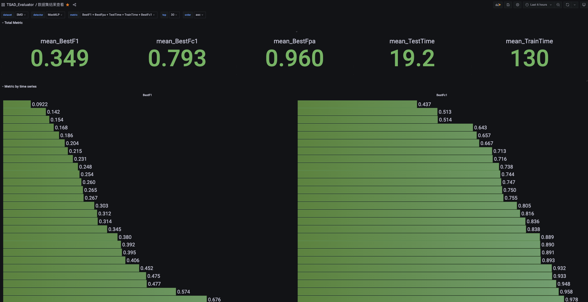
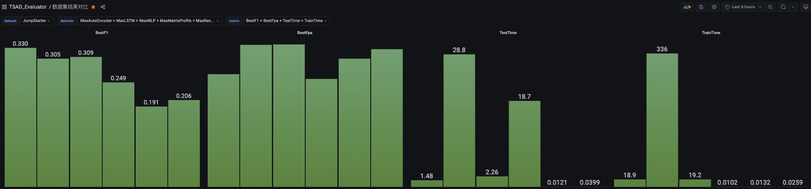

# TSAD_Evaluator

TSAD_Evaluator是一个用于评估各类时间序列异常检测(Time Series Anomaly Detection)
算法的框架，主要目的是能让研究人员专心于实现算法，而无需关心其他例如数据集处理、评估、可视化等流程，将算法之外的流程标准化、简易化、可配置化，其特性主要有以下几点：

- **可扩展**：内置对多种数据集的支持，将多种数据集处理成统一格式
- **可视化**：将数据和结果持久化存储到influxdb，用grafana进行可视化
- **通用性**：适配各类算法以及应用场景，只需实现相应的接口即可
- **简易性**：支持一键脚本化运行，快速评估单个算法/多个算法在一个数据集/多个数据集上的结果
- **全面性**：提供通用评价指标、针对时序数据设计的评价指标、自研指标、性能指标对算法进行全方位评估
  
## 目录
  - [系统介绍](#系统介绍)
    - [数据集支持](#数据集支持)
    - [可视化支持](#可视化支持)
    - [算法抽象](#算法抽象)
    - [检测流程标准化](#检测流程标准化)
    - [效果评估](#效果评估)
  - [如何使用](#如何使用)
    - [安装所需依赖](#安装所需依赖)
    - [导入数据集](#导入数据集)
    - [实现算法](#实现算法)
    - [评估算法](#评估算法)
    - [拓展实现](#拓展实现)
      - [对聚合函数的扩展](#对聚合函数的扩展)
      - [对自动确立阈值方法的扩展](#对自动确立阈值方法的扩展)
      - [对评价指标的扩展](#对评价指标的扩展)
  - [联系方式](#联系方式)
  - [参考文献](#参考文献)
## 系统介绍

<!-- 这边是不是应该有一张overview，整个系统的模块图 -->

### 数据集支持

在TSAD_Evaluator中，Dataset代表一个数据集，而一个数据集下会有多个时间序列数据TimeSeries，我们把TimeSeries处理成统一的格式:

```    
   timestamp    col1    col2    ...     colN
```

- 其中N是时间序列的维度，对于单维度的时间序列数据N=1
- 如果原来的数据集中有timestamp，则会沿用；否则会从2022-01-01 00:00:00开始认为每一分钟一个点的方式填充时间戳

目前已经支持的数据集

<!-- 之后可以显示下这些数据集的维度信息、点数、异常率等等，搞个表格-->

- 单维度：[Yahoo](https://webscope.sandbox.yahoo.com/catalog.php?datatype=s&did=70)
  , [KPI](https://github.com/NetManAIOps/KPI-Anomaly-Detection), [Industry](https://github.com/OpsPAI/ADSketch)
  , [UCR](https://wu.renjie.im/research/anomaly-benchmarks-are-flawed/#ucr-time-series-anomaly-archive)
- 多维度：[SMD](https://github.com/NetManAIOps/OmniAnomaly), [JumpStarter](https://github.com/NetManAIOps/JumpStarter),
  [SKAB](https://github.com/waico/SKAB), [PSM](https://github.com/eBay/RANSynCoders)

### 可视化支持

我们提供对数据、检测结果包括中间结果的一些可视化支持，主要原因是:

- 研究算法前：可以了解数据集的特点（是否是周期性、为什么是异常、异常的密度如何等信息），也能启发研究者想出针对的解决方案
- 研究算法中：观察算法的中间输出（例如预测类算法可以输出每个点的预测值），从而对算法拟合的效果有所了解（可能欠拟合or过拟合），可以进一步调优
- 研究算法后：直观了解算法对一个序列的检测结果（一般是检测分数）是否契合异常标注（而不仅仅是依赖评估指标的数字），并且可以与其他算法的结果进行对比

但为了减少依赖，避免该框架过于冗余，我们选择将数据和结果全部持久化到[Influxdb](https://github.com/influxdata/influxdb)
，然后用[Granfana](https://github.com/grafana/grafana) 来展示其中的数据，目前我们新建了5个Dashboard来展示特定的界面：

- 原数据查看：查看「选定数据集」的「选定时间序列」的统计信息、时间序列信息、标签
  
- 检测结果查看：查看「选定算法」在「选定数据集」的「选定序列」上的异常分数、中间结果、检测耗时和指标
  
  
- 检测结果对比：查看「多个选定算法」在「选定数据集」的「选定序列」上的异常分数、检测耗时和指标对比
  
- 数据集结果查看：查看「选定算法」在「选定数据集」下的整体检测指标和「各个序列」的检测指标
  
- 数据集结果对比：查看「多个选定算法」在「选定数据集」下的整体检测指标的对比
  

### 算法抽象

我们根据输入的数据维度、训练是否需要有标注数据、应用场景将一个检测算法解耦，拆成三个可灵活组合的模块:

- 输入的数据维度：单维度/多维度
- 训练是否有标注：有监督/无监督/无需训练
- 应用场景：离线/流式/触发式

> 关于触发式
>  - 定义：主要是对于某些时间序列数据，我们只对它在**特定时间范围**内有没有发生异常感兴趣，而不需要算法在每个时间点给出它是否异常或者异常分数，这在某些故障定位场景（而不是故障发现）中是比较常见的
>  - 实现：需要输入窗口大小和正负样本比例，我们对于测试集中的每一个（段）异常，都挑选其开头前后共计窗口大小的数据作为正例，然后再按照正负样本比例采样若干完全正常的数据作为负例组成触发异常检测的**时间范围**，在前端会用蓝色区域标识我们选择的区间

实现算法时，需根据每一模块所属的具体类别继承特定的类，实现其中的接口即可

### 检测流程标准化

除了基本的算法外，我们也提供将单维度检测算法应用于多维度数据集以及多个算法集成的功能，思路比较简单，具体来讲就是通过提供一个聚合函数，可以把单个算法在不同维度的检测结果 /
不同算法在同一数据集上的检测结果聚合成一个最终的检测结果，该聚合函数可以自定义（内置了取max和取mean）并且配置

因此总体来讲，对于一个「特定算法」在「特定时间序列数据」上的检测，我们有以下几步:

1. 训练：根据算法所需数据喂给算法
2. 对于触发式，要根据配置生成正负例
3. 预测：根据算法应用场景进行预测
    1. 离线：把测试数据全部喂给算法，得到检测的异常分数
    2. 流式：每次喂一个时间点的数据给算法，拼接起来得到检测的异常分数
    3. 触发式：将第2步中生成的**时间范围**以及一个获取历史数据的接口（具体获取多少依赖于算法内部调用）逐个喂给算法，得到一个检测的异常分数
4. 如果是单维度检测算法应用于多维度数据集以及多个算法集成，需要将多个检测的异常分数通过聚合函数聚合成一个异常分数
5. 该异常分数可以直接用于最后的效果评估，也可以提供一个阈值函数，将异常分数转化为0/1的是否异常值
6. 最后与标签对比，进行结果的评估

### 效果评估

如何评价一个时间序列异常检测算法的好坏，至今学术界没有一个统一的标准。Donut[[1]](#1)提出的point-adjust策略也在近年[[2]](#2)[[3]](#3)
被质疑其有效性：随机分数也能获得SOTA的结果，也相应提出了一些新的评价指标。受到[[4]](#4)的启发，我们提出了一个新的评价指标:


该方案与之前方案的对比如下：

| 评价指标          | 针对时序数据设计 | 随机分数效果差 | 位置敏感 | 无参数  |
| ----------------- | ---------------- | -------------- | -------- | ------- |
| F1                | &cross;          | &check;        | &check;  | &check; |
| Fpa[[1]](#1)      | &check;          | &cross;        | &cross;  | &check; |
| Range F1[[5]](#5) | &check;          | &check;        | &check;  | &cross; |
| Fc1[[2]](#2)      | &check;️          | &check;        | &cross;  | &check; |
| SPD[[4]](#4)      | &check;️          | &check;️        | &check;️  | &cross; |
| Fd1(Ours)         | &check;️          | &check;️        | &check;️  | &check;️ |

总体而言，我们的框架提供了以下三类评价指标的实现，会在算法运行结束后自动计算:

1. 二分类的检测指标：包括Precision、Recall、F1、Fpa、Fc1以及我们自研的Fd1
2. 性能检测指标：训练时间、预测时间，针对触发式我们还额外记录了花费在数据拉取上的时间
3. 第一类指标的Best计算以及AUPR计算

> 由于大部分算法给出的都是一个越大越异常的分数，而不是0或者1来表示是不是异常，因此无法直接用第1类指标。之前的工作大多选择枚举阈值选择效果最好的那个，而这个既不符合真实情况也容易对模型的效果进行过高的估计，因此我们不仅提供了以上每个指标的Best高效计算方式，还对AUPR进行了计算（比起AUROC更适合异常检测这种正负样本比例不均衡的场景）

此部分是可以方便扩展的，只要集成了有阈值/无阈值的抽象类，实现了评估方法，之后再次运行算法时就会被自动计算该指标

## 如何使用

该部分主要介绍如何使用该框架进行算法评估

### 安装所需依赖

<!-- 之后包装成docker，可以直接用 -->

首先保证python版本>=3.8，然后通过以下命令安装所需的python脚本

```
pip install -r requirements.txt
```

需要安装influxdb与grafana，参考官方教程，此处不再赘述

在config.py中配置influxdb连接的相关信息，本框架的所有导入数据、结果等都会存放在该数据库内
> 建议使用默认的TSAD_Evaluator，不然需要手动更改grafana的数据源等配置

```
INFLUXDB_HOST = 'localhost'
INFLUXDB_PORT = '8086'
INFLUXDB_USERNAME = 'root'
INFLUXDB_PASSWORD = 'root'
INFLUXDB_DBNAME = 'TSAD_Evaluator'
```

本地安装grafana并且启动服务后，需添加dashboard，我们已经将dashboard上传至grafana cloud，可以grafana前端通过dashboard_id一键导入，我们内置的五个dashboard为:

- 原数据查看：[16434](https://grafana.com/grafana/dashboards/16434)
- 检测结果查看：[16435](https://grafana.com/grafana/dashboards/16435)
- 检测结果对比：[16436](https://grafana.com/grafana/dashboards/16436)
- 数据集结果查看：[16437](https://grafana.com/grafana/dashboards/16437)
- 数据集结果对比：[16438](https://grafana.com/grafana/dashboards/16438)

### 导入数据集

需提前下载好，然后利用dataset/Dataset.py中Dataset的类方法fetch_XXX方法来从源文件解析并获取数据集实例，调用save()方法即可存入influxdb，之后可直接使用

例子:

```
Dataset.fetch_Yahoo('../data/Yahoo/ydata-labeled-time-series-anomalies-v1_0').save()
```

### 实现算法

实现自己的算法需要根据算法的分类继承特定的方法（如果有的话）

- 输入数据维度
    - 单维度算法：继承UnivariateDetector，无需额外实现方法
    - 多维度算法：继承MultivariateDetector，无需额外实现方法
- 训练是否有标注
    - 有监督方法：继承SupervisedFit并实现fit(self, x: np.ndarray, y: np.ndarray)方法
    - 无监督方法：继承UnsupervisedFit并实现fit(self, x: np.ndarray)
    - 无需训练方法：继承UnwantedFit，无需额外实现方法
- 应用场景
    - 离线：继承OfflinePredict并实现predict(self, x: np.ndarray)方法
    - 流式：继承StreamingPredict并实现init(self, x: np.ndarray)与predict(self, x: np.ndarray)方法
    - 触发式：继承TriggerPredict并实现predict(self, dataFetcher: Callable[[int], np.ndarray])方法

例子一: 一个基于MLP做预测，根据预测误差对多维时间序列做异常检测的离线算法需继承MultivariateDetector、UnsupervisedFit与OfflinePredict

```
class MLP(UnivariateDetector, UnsupervisedFit, OfflinePredict):

    def fit(self, x: np.ndarray):
        ...

    def predict(self, x: np.ndarray):
        ...
```

例子二：一个基于KSigma的方法，基于历史数据和均值和方差多单维度时间序列做异常检测的触发式算法需继承UnivariateDetector、UnwantedFit和TriggerPredict：

```
class KSigma(UnwantedFit, UnivariateDetector, TriggerPredict):

    def predict(self, dataFetcher: Callable[[int], np.ndarray]):
        ...

```

其他例子可以参考algorithm/目录下的已有算法实现

### 评估算法

算法运行主要由pipeline/task.py来实现，其中的TaskExecutor提供了一个对外的方法

```
@staticmethod
    def exec(data: Union[RawTimeSeries, Dataset, str], detector: Union[Detector, list[Detector]], detector_name: str,
             transform: Transform = None, aggregate: Aggregate = MaxAggregate(), threshold: Threshold = None,
             streaming_batch_size=1, window_size=20, anomaly_ratio=0.10):
```

其中有三个必填参数:

- 第一个参数data是要运行的数据集/时间序列，可以直接指定之前save()的数据集的名字，或者是手动加载之后传进来
- 第二个参数detector是实例化后的算法，也可以传一个算法的list用于集成
- 第三个参数detector_name是一个字符串，用于唯一标识一个算法（当尝试同一个算法的不同参数表现时建议用不同的name）
- 后续的参数都是可选，其中aggregate是用于将多个异常分数序列聚合成一个异常分数序列的方法，而threshold是将一个异常分数序列转化为一个0/1序列的方法

例子一: 对Yahoo数据集里的synthetic_1时间序列用LSTM算法进行检测

```
lstm_detector = LSTM(window_size=30)
raw_time_series = RawTimeSeries.load("Yahoo@synthetic_1")
TaskExecutor.exec(raw_time_series, detector=lstm_detector, detector_name=f"test_lstm")
```

例子二：对Industry数据集用MLP算法进行检测

```
TaskExecutor.exec("Industry", detector=MLP(window_size=30), detector_name='test_mlp')
```

其他更多例子可以参考pipiline/task.py中的实现de

### 拓展实现

#### 对聚合函数的扩展

只需继承Aggregate类并实现aggregate(self, train: list[list[float]], test: list[list[float]]) -> (list[float], list[float])
方法，然后在exec的时候传入aggregate=该类的实例即可

#### 对自动确立阈值方法的扩展

只需继承Threshold类并实现threshold(self, train: list[list[float]], test: list[list[float]]) -> list[float]
方法，然后在exec的时候传入threshold=该类的实例即可

#### 对评价指标的扩展

分是否有阈值两种:

- 有阈值的评价指标（也就是针对算法的输出为0/1）：在evaluate/metric_with_threshold中继承MetricWithThreshold并实现score(mcs, predict, label) ->
  float方法即可
- 无阈值的评价指标（也就是针对算法的输出为越大越异常的浮点数）：在evaluate/metric_without_threshold中继承MetricWithoutThreshold并实现score(mcs, predict,
  label) -> float方法即可

实现之后无需额外配置，之后的算法在运行结束后会**自动**根据输出之后是否有阈值来进行**所有评价指标**结果的计算

## 联系方式

该工具现在还不太完善，如果有新想法或者希望支持的功能欢迎提issue或者直接联系zhao-yf20@mails.tsinghua.edu.cn

## 参考文献

<a id="1">[1]</a>
Xu H, Chen W, Zhao N, et al. Unsupervised anomaly detection via variational auto-encoder for seasonal kpis in web
applications[C]//Proceedings of the 2018 world wide web conference. 2018:187-196.

<a id="2">[2]</a>
Garg, A., Zhang, W., Samaran, J., Savitha, R., & Foo, C. S. (2021). An Evaluation of Anomaly Detection and Diagnosis in
Multivariate Time Series. IEEE Transactions on Neural Networks and Learning Systems, PP, 1–10.

<a id="3">[3]</a>
Kim S, Choi K, Choi H S, et al. Towards a Rigorous Evaluation of Time-series Anomaly Detection[J]. arXiv preprint arXiv:
2109.05257, 2021.

<a id="4">[4]</a>
Doshi K, Abudalou S, Yilmaz Y. TiSAT: Time Series Anomaly Transformer[J]. arXiv preprint arXiv:2203.05167, 2022.

<a id="5">[5]</a>
Tatbul N, Lee T J, Zdonik S, et al. Precision and recall for time series[J]. Advances in neural information processing
systems, 2018, 31.